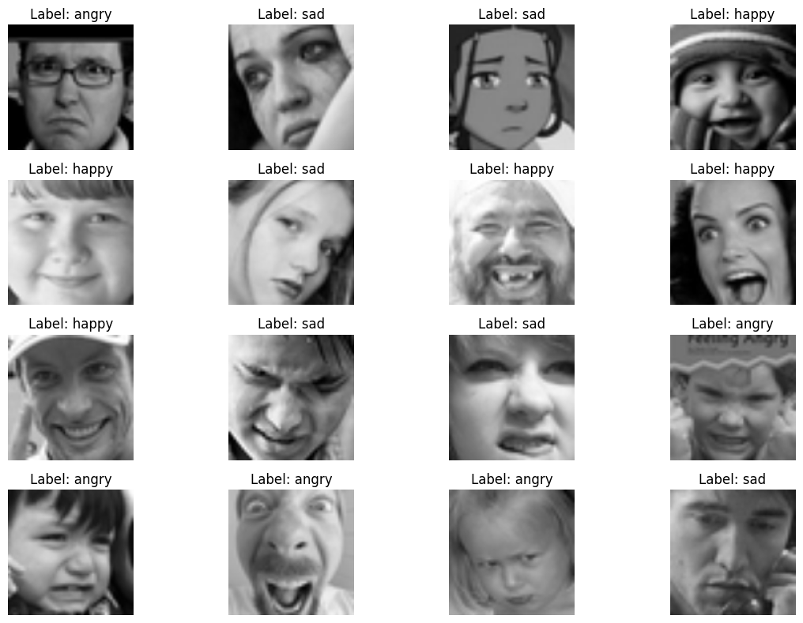
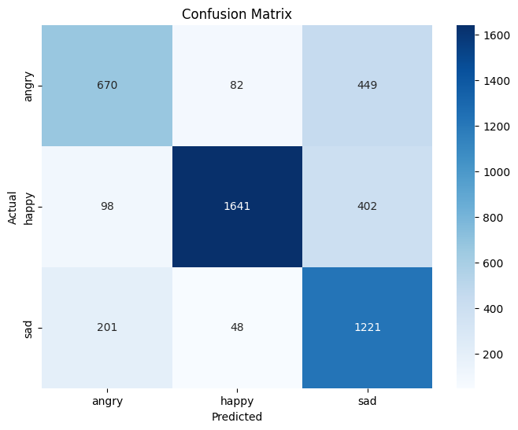

# Emotion Detection Model

This project implements an emotion detection model using a convolutional neural network (CNN) with PyTorch. The model is designed to classify images into different emotional categories based on facial expressions.

## Project Overview

The Emotion Detection Model leverages deep learning techniques to analyze facial expressions and classify them into distinct emotional categories. The model was trained on a diverse dataset, enhancing its ability to generalize and perform well in real-world scenarios.

### Dataset

The dataset used for training consists of labeled images depicting various emotions, providing a solid foundation for the model's learning process.

## Features
- **Convolutional Neural Network (CNN)**: The architecture utilizes multiple convolutional layers, batch normalization, and dropout layers to effectively capture and generalize features from the input images.
- **Data Augmentation**: Techniques such as rotation, flipping, and scaling were employed to increase the dataset's diversity and improve the model's robustness.
- **Real-Time Emotion Detection**: The model can be applied to live video feeds, providing immediate feedback on the detected emotions.

## Model Architecture

The CNN architecture consists of:
- Multiple convolutional layers that extract features from the input images.
- Max pooling layers that reduce spatial dimensions, enhancing computational efficiency.
- Global Average Pooling followed by fully connected layers that output the predicted emotion classes.

### Results

#### Confusion Matrix

The confusion matrix provides insight into the model's performance across different emotion classes, highlighting areas of strength and potential improvement.

#### Real-Time Detection Example

The model successfully detects and classifies emotions in real-time, demonstrating its practical application in dynamic environments.

## Evaluation

Upon completion of the training, the model was evaluated on a validation set, yielding metrics such as accuracy and a classification report. This evaluation confirmed the model's effectiveness and identified areas for further enhancement.

## License

This project is licensed under the MIT License - see the [LICENSE](LICENSE) file for details.
